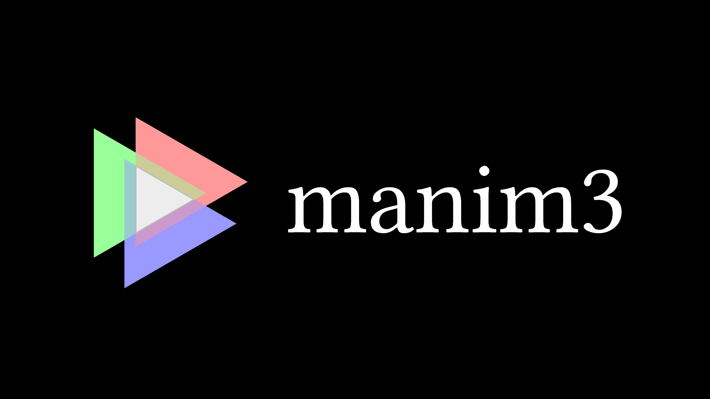

[](http://choosealicense.com/licenses/mit/)


## Introduction
Manim3 is a personal variant of [manim](https://github.com/3b1b/manim). It aims at standardizing the project structure, improving rendering performance and providing additional features.


## Installation
Manim3 runs on Python 3.12+ and OpenGL 4.3+.

You may install manim3 directly via
```sh
pip install manim3
```
to install the latest version distributed on pypi. Or, to catch up with the latest development and edit the source code, you may clone this repository via
```sh
git clone https://github.com/YishiMichael/manim3.git
cd manim3
pip install -e .
```
Additionally, there are other software dependencies to be installed:
- To generate video files, install [ffmpeg](https://ffmpeg.org/).
- To use `TypstMobject` (including `Text`, `Math`, `Code`), install [typst](https://github.com/typst/typst).


## Using manim3

The directory `examples` provides several demo scenes. Under that directory, simply run any script via `py xxx.py`. A window running a scene shall pop up.


## License
MIT license
